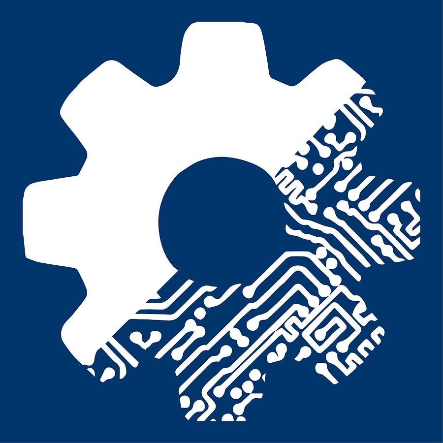
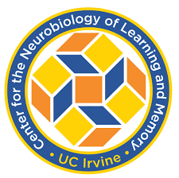
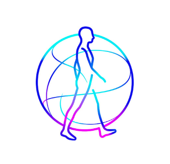
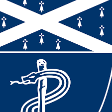
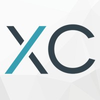
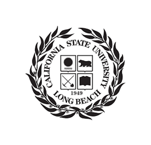
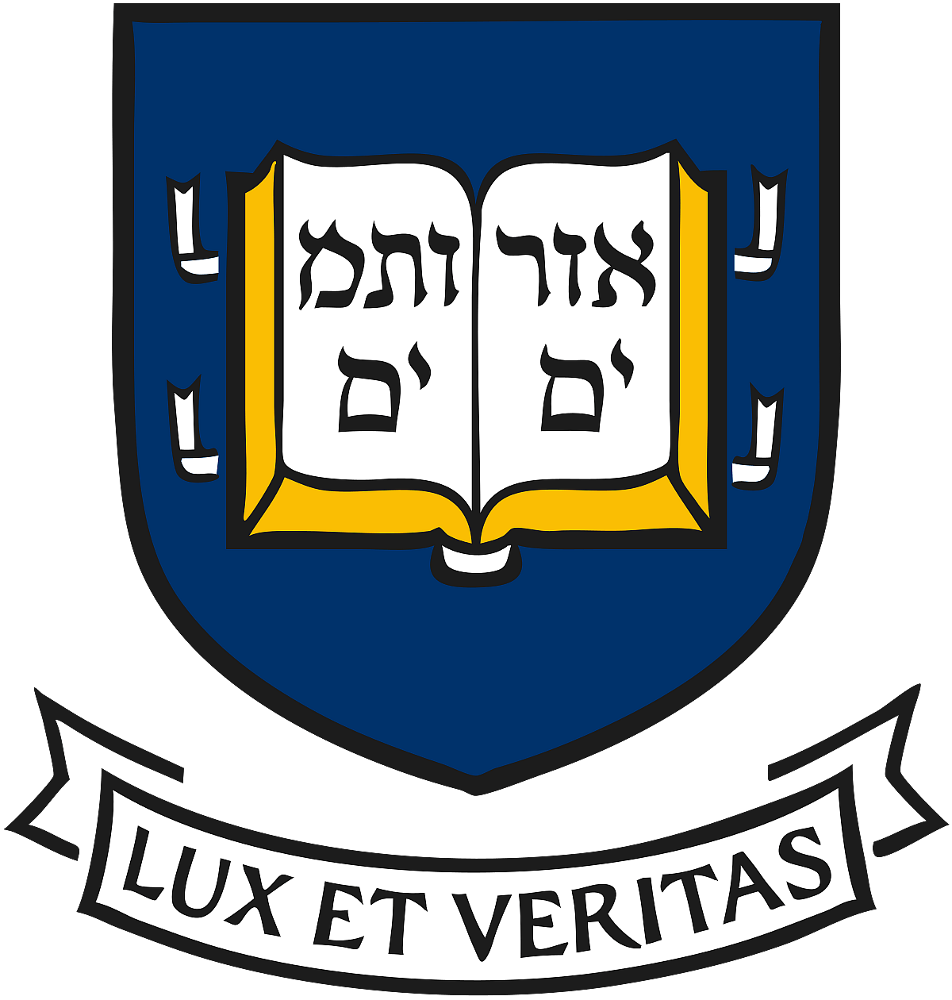
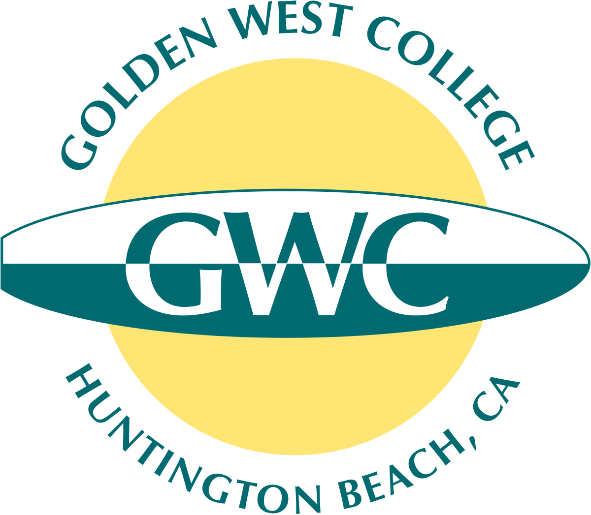

  

    
  

  

    

      I’m a student at <strong>Yale University</strong> studying <strong>Mechanical Engineering</strong> with minors in <strong>Computer Science</strong> and <strong>Data Science</strong>.
    

    
I'm passionate about healthcare technology (surgical robotics, healthcare apps), automating systems, and software engineering. Feel free to reach out at teresa.nguyen@yale.edu!

    </ul>
  

## Experience

  
  

    <strong>Faboratory – Software/ML Engineer Intern</strong> 
    Incoming Summer 2025 
    • Developing ML models for wearable robotics with Sim2Real, Arduino control, and motion-capture-based human modeling
  

  
  

    <strong>Biorobotics Lab – Computer Vision Researcher</strong> 
    April 2025 – Present 
    • Building real-time hand-tracking rehabilitation tools for proprioception
  

  
  

    <strong>Medtronic – Surgical Robotics Software Engineer / Co-Op</strong> 
    June 2024 – December 2024 
    • Led LLM chatbot and log analysis tool dev for Medtronic surgical robot; built dashboards, automated systems
  

  
  

    <strong>Smart Medicine Lab – Machine Learning Researcher</strong> 
    January 2024 – March 2025 
    • Lung cancer prediction models and imputation method research
  

  
  

    <strong>Yale School of Engineering – Teaching Assistant</strong> 
    September 2024 – April 2025 
    • Taught 100+ engineering students how to code in C, C++, and MATLAB
  

  
  

    <strong>XCentium – Data Analyst Intern</strong> 
    August 2022 – August 2023 
    • Data analysis and marketing strategies for clients
  

  
  

    <strong>California State University Long Beach – Nanomaterials Researcher</strong> 
    June 2022 – March 2023 
    • Researched fluorescent properties of silicone polymers and carbon quantum dots for advanced machine coating applications
  

## Education & Relevant Coursework

  
  

    <strong>Yale University</strong> 
    B.S. in Mechanical Engineering | Minors in Computer Science and Data Science 
    August 2023 – May 2027 
    Relevant Coursework: Data Structures & Programming Techniques, Object-Oriented Programming (OOP), Software Engineering, Computer Vision, Information Systems, Data Analysis, Multivariate Statistics, Linear Algebra, Differential Equations, Discrete Math, Multivariable Calculus, Physics (Mechanics, E&M), Computer Aided Design, Mechanical Design, Biomedical Research & Design, Computing for Engineers
  

  
  

    <strong>Golden West College</strong> 
    Associates in Art 
    June 2019 – June 2023 
    Graduated with a 4.0 and 6 degrees including in mathematics, science, and social science during high school.
  

## Awards

- **Yale College First-Year Summer Research Fellowship in the Sciences & Engineering**  
  _Yale University · 2024_

- **Society of Women Engineers Jean R. Beers Scholarship**  
  _SWE Connecticut · 2024_

- **Yale Hackathon – 3rd Place Grand Prize**  
  _Yale University · 2024_

- **NCWIT Aspirations in Computing – Affiliate Winner**  
  _National Center for Women & Information Technology · 2023_

- **Orange County Beckman Legacy Scholar**  
  _Beckman Foundation · 2023_

- **Arnold and Mabel Beckman Foundation Scholar**  
  _Beckman Foundation · 2023_

- **National Charity League Scholar**  
  _National Charity League · 2022_

## Technical Skills

🧠 **Programming Languages**  
Python · C/C++ · Java · R · SQL · HTML · CSS · TypeScript

📦 **Frameworks & Libraries**  
React.js · TensorFlow · Keras · Scikit-learn · Node.js · Angular

🧰 **Tools & Platforms**  
UNIX · Power BI · Google Analytics · Looker · Jira · Git · VSCode · Canva · CAD · SolidWorks
